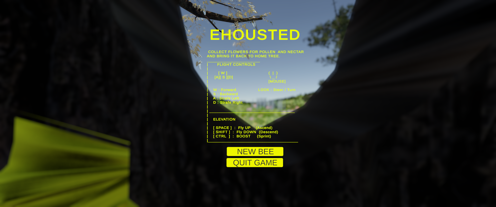
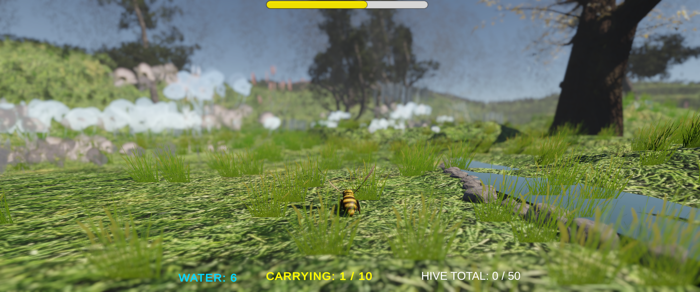
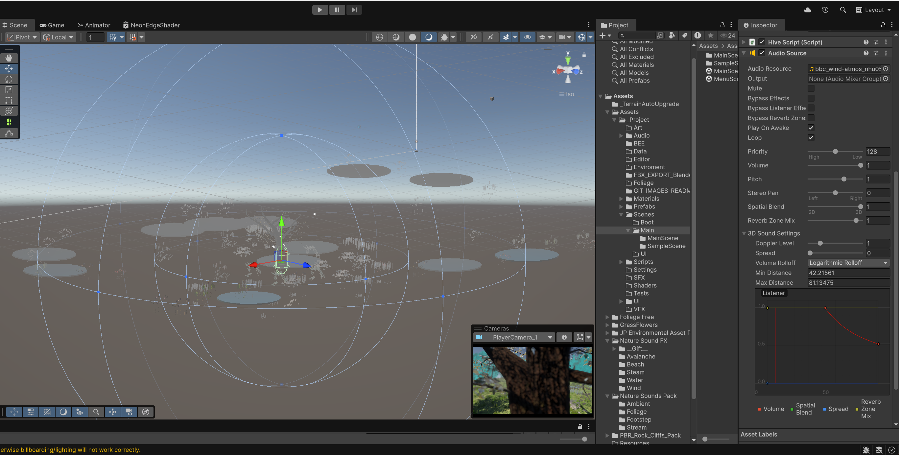

# 🐝 The Bee / Exhousted
> **A 4th-Year University Game Development Assignment**

**The Bee** is a 3D rogue-lite flight simulator that explores the life of a honey bee through physics-based gameplay. Players must balance risk vs. reward by managing flight stamina (nectar) and inventory weight (pollen) while navigating a semi-procedural meadow environment.

---

### 🎮 Help Me Test!
Click the button below to submit your feedback. It goes directly to a form (no account setup needed if you have GitHub).

---

## 🎮 Gameplay Overview
**Survive the Meadow. Fill the Hive.**

---

Take flight as a tiny bee in a massive world. The Bee is a relaxing yet strategic flying game where you explore a lush, dangerous meadow.

*   **Fly Fast, Carry Heavy:** The more pollen you collect, the slower you fly. Do you push your luck for a high score, or return home safe?
*   **Manage Your Fuel:** Nectar is your stamina. Run out, and you're grounded.
*   **Macro World:** Experience the world from a bug's eye view with immersive depth-of-field visuals and spatial sound.

---

## 🔑 Key Features

*   **Physics-Based Flight Controller**  
    Custom Rigidbody controller with drag, angular damping, and hover mechanics.

*   **Dynamic Weight System**  
    Collecting pollen increases mass, dynamically altering flight handling and speed (simulating real bee physics).

*   **Resource Management Loop**  
    A "Rogue-lite" core loop where players must balance gathering resources against a draining stamina bar before returning to the hive.

*   **Universal Render Pipeline (URP)**  
    Utilizes custom shaders for wind-affected vegetation and macro-style depth of field.

*   **Immersive Audio**  
    Features procedural engine sounds (pitch-shifting based on velocity) and 3D spatial audio for landmarks.

---
## ⚙️ Build & Security

This project was built and compiled using professional standard tools to ensure stability and safety.

* **Compiler:** Inno Setup 6.2 (Standard Windows Installer)
* **Virus Scan:** 0/60 Verified Clean via VirusTotal.
    * *Note: Windows SmartScreen may flag the installer as "Unknown" because it is not digitally signed. This is normal for student projects.*
    * [View Virus Scan Screenshot](Assets/Documentation_Images/virus_totalscan.png)

### ⚠️ False Positives
Some smaller antivirus engines may flag the "Input System" as generic suspicious behavior because the game listens for key presses (WASD). This is a known false positive for Unity games.

## 🛠️ Tech Stack

| Category | Technology |
| :--- | :--- |
| **Engine** | Unity 2022.3 (URP) |
| **Language** | C# |
| **Tools** | VS Code , Blender 4.5  |

---

## 🔮 Roadmap & Voting
We are planning the next major update for **The Bee**! We have categorized potential features by difficulty (Story Points).

| Difficulty | Feature Idea | Description |
| :--- | :--- | :--- |
| 🟢 **Easy** | **UV Vision** | See the world like a bee (Purple/Blue filter). |
| 🟢 **Easy** | **Photo Mode** | Freeze time to take macro screenshots. |
| 🟡 **Medium** | **Dynamic Weather** | Random rain (drains stamina) and wind events. |
| 🟡 **Medium** | **Hive Upgrades** | Spend pollen to buy speed/stamina boosts. |
| 🔴 **Hard** | **Predators** | Avoid the Hornet AI patrolling the forest. |

### 🗳️ Cast Your Vote!
Click the button below to visit our Community Poll and react with an emoji for the feature you want most.

---

### 📊 Live Feedback Stats

## 📚 Credits & Third-Party Assets
This project was created for educational purposes. All third-party assets are used under their respective licenses.

### 🎨 3D Models & Environment
* **Honey Bee Model:** 
Shrikant,  Honey Bee [3D Model]. Available at: https://sketchfab.com/3d-models/honey-bee-4d0142c47688483caba624c9bf55b963 (Accessed: 04 October 2025)
* **Environment Assets:** 
UModeler, Inc. (2022) Trees Collection Asset PBR. Available at: https://assetstore.unity.com/packages/3d/vegetation/trees/trees-collection-asset-pbr-241435#publisher (Accessed: 05 December 2025).
* **Vegetation:** 
Jungle Pirate (2023) JP Environmental Asset Pack. Available at: https://assetstore.unity.com/packages/3d/environments/landscapes/jp-environmental-asset-pack (Accessed: 05 December 2025).
Unity Technologies (2018) Standard Assets. Available at: https://assetstore.unity.com (Accessed: 05 December 2025).

### 🔊 Audio
* **Sound Effects:** 
BBC (2024) BBC Rewind: Sound Effects. Available at: https://sound-effects.bbcrewind.co.uk/ (Accessed: 05 December 2025).

### 🛠️ Tools & Tech
* **Engine:** Unity 2022.3 LTS
* **IDE:** Visual Studio Code
* **AI Assistance:** Code debugging and documentation support provided by Google Gemini.
Google (2024) Gemini. Available at: https://gemini.google.com/ (Accessed: 05 December 2025).